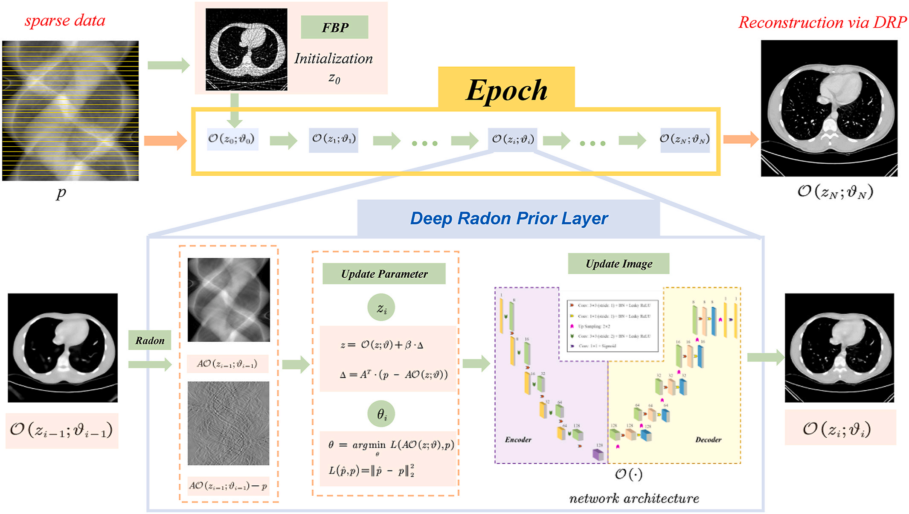

# Deep Radon Prior (DRP)

Deep Radon Prior (DRP) — a fully unsupervised framework for sparse-view CT reconstruction.



## Introduction

This repository contains a minimal, research-oriented implementation of the method described in the paper "Deep Radon Prior: A fully unsupervised framework for sparse-view CT reconstruction" (Xu et al., 2025). DRP integrates a neural network as an implicit image prior into an iterative reconstruction loop driven by Radon-domain feedback. The approach requires no paired training data and is designed to suppress sparse-view artifacts while preserving image detail.

## Abstract
Background: 
Sparse-view computed tomography (CT) substantially reduces radiation exposure but often introduces severe artifacts that compromise image fidelity. Recent advances in deep learning for solving inverse problems have shown considerable promise in enhancing CT reconstruction; however, most approaches heavily rely on high-quality training datasets and lack interpretability.

Method: 
To address these challenges, this paper introduces a novel, fully unsupervised deep learning framework that mitigates the dependency on extensive labeled data and improves the interpretability of the reconstruction process. Specifically, we propose the Deep Radon Prior (DRP) framework, inspired by the Deep Image Prior (DIP), which integrates a neural network as an implicit prior into the iterative reconstruction process. This integration facilitates the image domain and the Radon domain gradient feedback and progressively optimizes the neural network through multiple stages, effectively narrowing the solution space in the Radon domain for under-constrained imaging protocols.

Results: 
We discuss the convergence properties of DRP and validate our approach experimentally, demonstrating its ability to produce high-fidelity images while significantly reducing artifacts. Results indicate that DRP achieves comparable or superior performance to supervised methods, thereby addressing the inherent challenges of sparse-view CT and substantially enhancing image quality.

Conclusions: 
The introduction of DRP represents a significant advancement in sparse-view CT imaging by leveraging the inherent deep self-correlation of the Radon domain, enabling effective cooperation with neural network manifolds for image reconstruction. This paradigm shift toward fully unsupervised learning offers a scalable and insightful approach to medical imaging, potentially redefining the landscape of CT reconstruction.

## Paper (citation)

If you use this code or the DRP method in your research, please cite:

```bibtex
@article{xu_deep_2025,
  title = {Deep Radon Prior: A fully unsupervised framework for sparse-view CT reconstruction},
  author = {Xu, Shuo and Fu, Jintao and Sun, Yuewen and Cong, Peng and Xiang, Xincheng},
  journal = {Computers in Biology and Medicine},
  volume = {189},
  pages = {109853},
  year = {2025},
  doi = {10.1016/j.compbiomed.2025.109853},
  url = {https://www.sciencedirect.com/science/article/pii/S0010482525002033}
}
```

The complete BibTeX entry is also available in `导出的条目.bib` in the repository.

## Repository layout (important files)

- `DRP.py`               — Main script (kept for compatibility)
- `models/`              — Network definitions (skip, unet, etc.)
- `torch_radon/`         — Radon transform utilities (external package expected)
- `data_input/`          — Example input phantom(s) (do not include private data)
- `data_results/`        — Output directory for reconstructions and metrics
- `environment_drp_win.yml` — Suggested Conda environment (Windows)

## Installation (recommended)

We recommend creating an isolated Conda environment on Windows. Example steps (cmd.exe):

```bat
conda create -n drp python=3.9 -y
conda activate drp
```

1) Install PyTorch (example: CUDA 11.3 wheels)

```bat
pip install torch==1.11.0+cu113 torchvision==0.12.0+cu113 torchaudio==0.11.0 --extra-index-url https://download.pytorch.org/whl/cu113
```

2) Install TorchRadon (see upstream repository)

```bat
git clone https://github.com/matteo-ronchetti/torch-radon.git
cd torch-radon
pip install .
cd ..
```

3) Install other Python dependencies

```bat
pip install numpy scipy pandas scikit-image matplotlib
```

Alternatively, you can create the Conda environment from the provided environment file:

```bat
conda env create -f environment_drp_win.yml
conda activate drp
```

Note: verify your CUDA / PyTorch compatibility before installing the specific wheel versions.

## Running the code

Place your projection data (for example `phantom.mat` containing a `data` array) under `data_input/` and run either the original script or the small refactored runner:

```bat
python DRP.py
# or (recommended for easier parameter changes):
python DRP.py --input ./data_input/phantom.mat --output ./data_results/phantom-60/ --n_angles 60
```

Outputs saved to the configured `data_results/` folder include:

- FBP initialization (`fbp.mat`)
- Per-epoch reconstructions (`000.mat`, `001.mat`, ...)
- Per-epoch metrics CSV (`PSNR_SSIM-<n_angles>.csv`)
- Checkpoint models (`best_model.pt`, `latest_model.pt`)


## Acknowledgements

This implementation uses and thanks the authors of the open-source TorchRadon project: https://github.com/matteo-ronchetti/torch-radon

We also thank the authors of Deep Image Prior (DIP) for the inspirational idea of using an untrained network as an implicit image prior (Ulyanov et al., 2018), which motivated parts of the DRP design.

